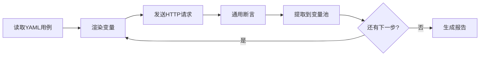

# 接口自动化测试框架

基于 **pytest + YAML 数据驱动 + 统一执行引擎** 的接口自动化方案，对接 [health-community](../backend) 后端项目。

## 快速开始

```bash
cd auto_test
python3 -m venv .venv
source .venv/bin/activate
pip install -r tests/requirements.txt

# 配置测试账号（变量名见 config/setting.py）
# 编辑 .env 填写 USER_USERNAME、USER_PASSWORD 等

# 运行当前已有测试
python run.py              # 全部
python run.py --unit       # 仅单元测试
python run.py --integration --allure  # 集成 + Allure
```

## 目录结构

```
auto_test/
├── FRAMEWORK.md          # 本文档：设计思路与分步实施指南
├── cases/                # YAML 用例（数据层，核心）
│   ├── template.example.yaml
│   ├── user/             # 登录、发帖
│   ├── food/             # 食物搜索、饮食记录
│   └── health/           # 健康档案、体重（待扩展）
├── config/               # 环境配置
│   ├── setting.py
│   └── dev.yaml
├── utils/                # 工具层（含 HTTP 封装 http_client.py）
│   ├── loader.py         # ✅ 第一步
│   ├── variable_pool.py  # ✅ 第二步
│   ├── render.py         # ✅ 第二步
│   ├── response_accessor.py  # ✅ 第三步
│   ├── assertion.py      # ✅ 第三步
│   ├── extract.py        # ✅ 第三步
│   └── http_client.py    # ✅ 第四步
├── core/                 # 执行引擎
│   └── runner.py         # ✅ 第四步
├── docs/                 # 分步详解文档
│   ├── STEP02_变量池与渲染.md
│   ├── STEP03_断言与提取.md
│   ├── STEP04_Runner执行引擎.md
│   ├── STEP05_入口与报告.md
│   └── 面试回顾_框架话术与断言策略.md
├── testcases/            # pytest 测试入口（按模块薄拆 + 全量扫描）
│   ├── test_user_api.py
│   ├── test_food_api.py
│   ├── test_all_cases.py
│   ├── test_case_loader.py
│   ├── test_render.py
│   ├── test_assertion_extract.py
│   ├── test_runner.py
│   ├── test_flow.py
│   └── test_api.py       # 兼容旧入口，已废弃
├── conftest.py           # pytest fixture
├── pytest.ini
└── run.py                # 统一调度入口
```

## 实施进度

| 步骤 | 模块 | 状态 |
|------|------|------|
| 第一步 | YAML 规范 + `utils/loader.py` | ✅ 已完成 |
| 第二步 | `utils/variable_pool.py` + `utils/render.py` | ✅ 已完成 |
| 第三步 | `utils/assertion.py` + `utils/extract.py` | ✅ 已完成 |
| 第四步 | `core/runner.py` + 集成测试 | ✅ 已完成 |
| 第五步 | `run.py` + Allure + 串联用例 | ✅ 已完成 |

---

## 一、为什么选 B 档方案

面向求职与可维护性，采用 **数据驱动 + 执行引擎** 架构：

- **用例是数据**：接口路径、参数、断言、提取规则写在 YAML，不写死在 Python
- **引擎是核心**：固定流水线 `读用例 → 渲染变量 → 发请求 → 断言 → 提取 → 报告`
- **工具层可扩展**：断言、提取、渲染做成通用模块，新增接口只加 YAML

与旧方案（`apis/UserApi` + `services/UserService` + 测试里手写 `assert`）相比，B 档更适合面试讲述「参数关联」「框架分层」「可维护性」。

---

## 二、整体执行流程



---

## 三、YAML 用例规范

### 单条用例结构

| 字段 | 必填 | 说明 |
|------|------|------|
| `case_id` | 是 | 唯一标识，用于 pytest `ids` 与报告 |
| `name` | 是 | 用例中文名 |
| `module` | 否 | 模块分类：`user` / `admin` / `post` |
| `steps` | 是 | 步骤列表，按顺序执行 |

### 每个 step 结构

| 字段 | 必填 | 说明 |
|------|------|------|
| `name` | 否 | 步骤名称 |
| `request` | 是 | `method`、`url`、`headers`、`json`、`params` |
| `validate` | 否 | 断言规则列表（由 `utils/assertion.py` 执行） |
| `extract` | 否 | 提取规则（由 `utils/extract.py` 写入变量池） |

### 占位符约定

| 写法 | 来源 | 示例 |
|------|------|------|
| `${ENV_VAR}` | `.env` / 环境变量 | `${USER_USERNAME}` |
| `${var}` | 变量池（上一步 extract） | `${token}`、`${post_id}` |

### 示例

参考 [`cases/user/login_success.yaml`](cases/user/login_success.yaml)：

```yaml
case_id: user_login_success
name: 用户登录成功
module: user
steps:
  - name: 用户登录
    request:
      method: POST
      url: /user/login
      json:
        username: ${USER_USERNAME}
        password: ${USER_PASSWORD}
        rememberMe: true
    validate:
      - eq: [status_code, 200]
      - eq: [body.code, 200]
      - type_match: [body.data.token, str]
    extract:
      token: body.data.token
      user_id: body.data.userId
```

### 断言规则（第三步实现）

| 规则 | 写法 | 含义 |
|------|------|------|
| 相等 | `eq: [body.code, 200]` | 实际值等于期望值 |
| 不等 | `ne: [body.code, 200]` | 实际值不等于期望值 |
| 包含 | `contains: [body.message, 成功]` | 字符串/列表包含 |
| 类型 | `type_match: [body.data.token, str]` | 类型匹配 |

路径约定：`status_code` 指 HTTP 状态码；`body.xxx` 指响应 JSON 体字段。

### 提取规则（第三步实现）

```yaml
extract:
  token: body.data.token
  user_id: body.data.userId
```

---

## 四、分步实施指南

### 第一步：YAML 规范 + 用例加载器 ✅

**设计思路**

先把「用例长什么样」定死，再写代码。所有后续模块都依赖同一套 YAML 结构，避免返工。

**已完成内容**

- `cases/` 目录与模板 `template.example.yaml`
- `cases/user/login_success.yaml`、`login_fail.yaml`（与 backend `LoginDTO`、`Result` 对齐）
- `utils/loader.py`：`load_case()`、`load_cases()`、`list_case_files()`
- `testcases/test_case_loader.py`：验收 loader 可用
- `config/setting.py`：使用 `ROOT_DIR` 固定路径

**验证命令**

```bash
pytest testcases/test_case_loader.py -v
```

---

### 第二步：变量池 + 渲染 ✅

**设计思路**

实现「数据关联」的基础：用例里写 `${USER_USERNAME}`、`${token}`，执行前统一替换成真实值。

**已完成内容**

- `utils/variable_pool.py`：变量存取、`load_env()`、`resolve()` 按优先级查找
- `utils/render.py`：`render_string()`、`render()` 递归渲染、`render_step_request()` 便捷函数
- `testcases/test_render.py`：验收测试
- 详解文档：[`docs/STEP02_变量池与渲染.md`](docs/STEP02_变量池与渲染.md)

**验证命令**

```bash
pytest testcases/test_render.py -v
```

---

### 第三步：通用断言 + 提取 ✅

**设计思路**

把测试脚本里的手写 `assert` 收拢到工具层；YAML 的 `validate`、`extract` 在此真正执行。

**已完成内容**

- `utils/response_accessor.py`：按 `body.data.token` 路径从响应取值（断言/提取共用）
- `utils/assertion.py`：`run_validations()`，支持 `eq/ne/contains/type_match`
- `utils/extract.py`：`extract_vars()`，提取结果写入变量池
- `testcases/test_assertion_extract.py`：Mock 响应验收测试
- 详解文档：[`docs/STEP03_断言与提取.md`](docs/STEP03_断言与提取.md)

**验证命令**

```bash
pytest testcases/test_assertion_extract.py -v
```

---

### 第四步：执行引擎 Runner ✅

**设计思路**

串联 loader → render → HTTP → assertion → extract；pytest 只调 `case_runner.run(case)`。

**已完成内容**

- `core/runner.py`：`CaseRunner`
- `utils/http_client.py`：发请求（json / params / **files 上传**；multipart 时自动去掉 JSON Content-Type）
- `conftest.py`：`case_runner`、`backend_available` fixture
- `testcases/test_api.py`：登录成功/失败集成测试
- `testcases/test_runner.py`：Runner 单元测试（mock）
- `cases/user/login_success.yaml`：按字段特性区分 eq / type_match
- 详解文档：[`docs/STEP04_Runner执行引擎.md`](docs/STEP04_Runner执行引擎.md)

**验证命令**

```bash
# 单元测试（不需 backend）
pytest testcases/ -m "not integration" -v

# 集成测试（需 backend + .env）
pytest testcases/test_api.py -v
```

---

### 第五步：入口调度 + 报告 + 串联场景 ✅

**已完成内容**

- `run.py`：`--unit` / `--integration` / `--allure` / `--html`
- `cases/user/login_post_flow.yaml`：登录 extract token → 发帖
- `core/runner.py`：Allure 分步 + 请求/响应附件
- `testcases/test_flow.py`：串联用例 mock 测试
- 详解文档：[`docs/STEP05_入口与报告.md`](docs/STEP05_入口与报告.md)

**验证命令**

```bash
python run.py --unit
python run.py --integration
python run.py --integration --allure
```

---

### 第六步：数据库校验（PyMySQL）✅

**设计思路**

接口断言之后，用 `db_validate` 查 MySQL 核对落库；用例级 `teardown` 清理脏数据。与 backend `test` profile 共用同一库。

**已完成内容**

- `config/test.yaml`：`database.enabled: true`
- `utils/db_client.py`：PyMySQL 连接、`query_one` / `execute`
- `utils/db_assertion.py`：`db_validate` + `teardown`
- `utils/assertion.py`：`run_validations_on_mapping`（DB 行复用 eq/contains 规则）
- `core/runner.py`：step 末尾 `db_validate`；`finally` 执行 `teardown`
- `conftest.py`：`db_available` fixture
- `cases/user/login_post_flow.yaml`：发帖后查 `hc_post` + 清理

**`.env` 需配置**

```env
TEST_ENV=test
DB_USERNAME=root
DB_PASSWORD=你的密码
```

**YAML 示例**

```yaml
db_validate:
  - sql: "SELECT content, status FROM hc_post WHERE id = ${post_id}"
    expect:
      - eq: [content, "自动化测试发帖"]
      - eq: [status, "PENDING"]

teardown:
  - sql: "DELETE FROM hc_post WHERE id = ${post_id}"
```

**验证命令**

```bash
pytest testcases/test_user_api.py::TestUserApi::test_login_post_flow -v
```

---

### 第七步：并发执行 + Jenkins 自动回归（CI/CD）✅

**并发执行（pytest-xdist）**

- 项目已依赖 `pytest-xdist`，可并发跑集成用例提升回归速度
- 用法：通过 `run.py` 透传 pytest 参数即可开启并发

```bash
python run.py --integration --allure -- -n auto
```

**Jenkins 自动回归**

仓库根目录提供 `Jenkinsfile`，流水线会：

- `docker compose up -d` 拉起 MySQL/Redis/MinIO/ES（`backend/docker-compose.yaml`）
- `mvn spring-boot:run -Dspring-boot.run.profiles=test` 启动后端
- 在 `auto_test/` 创建 venv，安装依赖
- 并发跑集成测试：`python run.py --integration --allure -- -n auto`
- 归档 `auto_test/reports/**`（Allure 结果/报告）

本地快速复现脚本：

```bash
bash ci/jenkins/run_api_tests.sh
```

---

## 五、已删除的旧产物说明

| 删除项 | 原因 |
|--------|------|
| `testcases/test_user_api/` | 旧测试脚本，手写 assert，YAML 与 backend 不一致 |
| `services/` | 旧业务层，由 Runner + YAML 替代 |
| 旧版 `apis/`（BaseApi、UserApi 等） | 代码驱动残留；HTTP 封装已迁至 `utils/http_client.py` |
| `schemas/` | B 档主流程不需要，见下节 |

---

## 六、关于 schemas（Pydantic VO）是否还需要

**结论：B 档主流程不需要单独的 `schemas/` 目录。**

| 对比 | `schemas/`（Pydantic） | YAML `validate` + `assertion.py` |
|------|------------------------|----------------------------------|
| 用途 | 强类型校验响应结构 | 配置化断言，非开发也能维护 |
| B 档角色 | 非必需 | 核心 |

后端 `LoginVO` 等结构，在测试中通过 YAML 表达即可：

```yaml
validate:
  - eq: [body.code, 200]
  - type_match: [body.data.userId, int]
```

若某一接口响应极其复杂，可在 `utils/assertion.py` 内按需引入 Pydantic，不必恢复独立 `schemas/` 目录。

---

## 七、环境配置

### `.env` 变量

```env
TEST_ENV=dev
USER_USERNAME=你的测试用户名
USER_PASSWORD=你的测试密码
```

### `config/dev.yaml`

```yaml
base_url: "http://localhost:8080"
headers:
  Content-Type: "application/json"
timeout: 30
```

运行接口用例前需先启动 backend。

---

## 八、与 backend 的对应关系

| backend | 测试框架 |
|---------|----------|
| `UserController` `/user/login` | YAML `request.url: /user/login` |
| `LoginDTO` | YAML `request.json` |
| `Result<T>` | YAML `validate` 中 `body.code` 等 |
| `LoginVO` | YAML `extract` 中 `body.data.token` |
| JWT 鉴权 | 变量池 `${token}` → `Authorization` header |

---

## 九、面试可讲的话术

1. **框架分层**：`cases` 数据层 → `utils` 工具层 → `core/runner` 引擎层 → `testcases` 调度层
2. **数据驱动**：新增场景只加 YAML，不改 Python
3. **参数关联**：`extract` → `render` → 下一步请求自动带鉴权
4. **可维护性**：断言统一在 `assertion.py` 扩展

---

## 十、框架已闭环

B 档五步全部完成。后续可按业务扩展 `cases/` 下 YAML 用例，无需改框架核心代码。

分步详解见 `docs/` 目录；面试话术与断言策略见 [`docs/面试回顾_框架话术与断言策略.md`](docs/面试回顾_框架话术与断言策略.md)。
